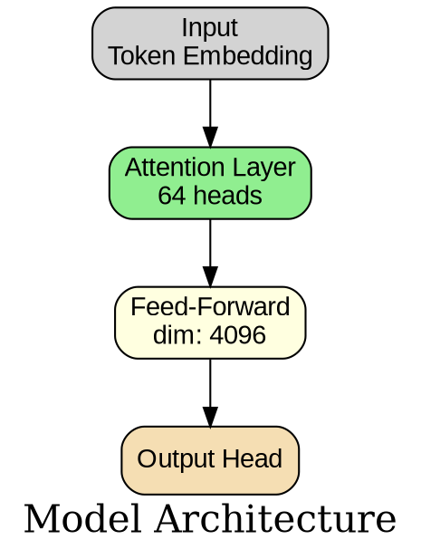

# Model Architecture Visualizer

Generate visual diagrams of neural network architectures from model names.

## Workflow

When a user requests visualization of a model (e.g., "Draw the architecture of model X"):

### 0. Task Clarification Phase (CRITICAL!)

**Before starting any research, confirm the exact model name and version:**

1. **Verify the model identifier**
   - If user says "Qwen3.5-397B-A17B", search for **exactly that**
   - Don't assume "Qwen3" means "Qwen3.5"
   - Don't drop suffixes like "-397B-A17B", "-72B", "-Instruct"
   
2. **Check for version ambiguity**
   - "GPT-4" vs "GPT-4o" vs "GPT-4 Turbo"
   - "Llama 3" vs "Llama 3.1" vs "Llama 3.2"
   - "Qwen3" vs "Qwen3.5" ← **completely different architectures!**

3. **Confirm with user if unclear**
   ```
   ❌ Bad: User says "Qwen3.5", you search "Qwen3"
   ✅ Good: User says "Qwen3.5", you search "Qwen3.5-397B-A17B"
   ✅ Good: If ambiguous, ask: "Which version? Qwen3 or Qwen3.5?"
   ```

4. **Use the full model name in searches**
   ```bash
   # ✅ Correct
   site:huggingface.co "Qwen3.5-397B-A17B" architecture
   
   # ❌ Wrong (too generic)
   site:huggingface.co "Qwen" architecture
   ```

**Why this matters:**
- Qwen3 ≠ Qwen3.5 (different architectures: pure Transformer vs Hybrid DeltaNet+Attention)
- Llama 3 ≠ Llama 3.1 (context length, architecture tweaks)
- GPT-4 ≠ GPT-4o (multimodal vs text-only)

### 1. Research Phase

Extract architecture information from these sources (in priority order):

**a) GitHub Repository**
- Search: `site:github.com "model-name" architecture`
- Look for `config.json`, `modeling_*.py`, README diagrams
- Extract: layers, attention mechanisms, hidden dimensions, special components

**b) Research Paper**
- Search: `site:arxiv.org "model-name" architecture` or `"model-name" paper pdf`
- Focus on Method/Architecture sections and figures
- Extract: layer count, block types, hyperparameters

**c) Hugging Face**
- Check model card: `https://huggingface.co/organization/model-name`
- Review `config.json` and model card documentation
- Extract: official configuration details

**d) Technical Blogs**
- Check official blog posts from model creators
- Look for simplified architecture explanations

For detailed extraction strategies, see [references/extraction-guide.md](references/extraction-guide.md).

### 2. Structure Phase

Convert extracted information into JSON config format:

```json
{
  "model_name": "Model Name",
  "title": "Model Architecture",
  "source": "GitHub/Paper/HuggingFace URL",
  "stages": [
    {
      "name": "Stage Name",
      "blocks": [
        {
          "type": "Block Type",
          "details": "Additional info"
        }
      ]
    }
  ],
  "custom_nodes": [
    {
      "id": "unique_id",
      "label": "Display Label",
      "color": "lightgray"
    }
  ],
  "custom_edges": [
    {
      "from": "node_id",
      "to": "node_id",
      "label": "optional label"
    }
  ]
}
```

**CRITICAL: For Repeating Layer Patterns**

When a model has repeating layer patterns (e.g., "15 × (3 DeltaNet + 1 Attention)"):

❌ **Bad - Abstract Description:**
```json
{
  "stages": [
    {
      "name": "Hybrid Layers",
      "blocks": [
        {
          "type": "Pattern Unit (×15)",
          "details": "Each unit: 3 DeltaNet + 1 Attention"
        }
      ]
    }
  ]
}
```
Problem: Doesn't show the actual layer structure, just describes it.

✅ **Good - Explicit Expansion:**
```json
{
  "stages": [
    {
      "name": "60 Layers Total",
      "blocks": [
        {
          "type": "Repeating Pattern (×15 times)",
          "details": "Each pattern = 4 layers"
        }
      ]
    },
    {
      "name": "Single Pattern Detail (4 layers)",
      "blocks": [
        {
          "type": "Layer 1: DeltaNet + MoE",
          "details": "Linear attention O(n)\nQ/K:16, V:64, dim:128"
        },
        {
          "type": "Layer 2: DeltaNet + MoE",
          "details": "Linear attention O(n)\nQ/K:16, V:64, dim:128"
        },
        {
          "type": "Layer 3: DeltaNet + MoE",
          "details": "Linear attention O(n)\nQ/K:16, V:64, dim:128"
        },
        {
          "type": "Layer 4: Attention + MoE",
          "details": "Standard attention O(n²)\nQ:32, KV:2, dim:256"
        }
      ]
    }
  ]
}
```

**Why explicit is better:**
- Shows actual layer sequence
- Makes pattern clear in visualization
- Easier to understand the 3:1 ratio
- Avoids ambiguity

**Block Type Colors:**
- Attention blocks → `lightgreen`
- Mamba/SSM blocks → `lightcoral`
- MLP/FFN blocks → `lightyellow`
- Layer Norm → `lightblue`
- Input/Embedding → `lightgray`
- Output Head → `wheat`

See [assets/example_config.json](assets/example_config.json) for a complete template.

### 3. Visualization Phase

Generate the diagram:

```bash
python3 scripts/visualize_architecture.py config.json -o output_name -f png
```

**Options:**
- `-o, --output`: Output file path (without extension)
- `-f, --format`: Output format (`png`, `svg`, `pdf`) - default: `png`
- `--dot-only`: Generate only the DOT file without rendering
- `--markdown`: Also generate a Markdown documentation file

**Prerequisites:**
If Graphviz is not installed:
```bash
# macOS
brew install graphviz

# Linux
sudo apt-get install graphviz

# Verify
which dot
```

### 4. Markdown Documentation (Optional)

When the user needs a detailed written specification, generate a comprehensive Markdown file:

```bash
# Generate both diagram and Markdown
python3 scripts/visualize_architecture.py config.json -o output_name -f png --markdown

# Or generate manually from JSON config
python3 scripts/generate_markdown.py config.json -o model_architecture.md
```

**Markdown Output Structure:**

```markdown
# {Model Name} Architecture

**Source:** {Paper/GitHub/HuggingFace URLs}  
**Total Parameters:** {if available}  
**Activated Parameters:** {if MoE}  

## Architecture Overview

{High-level description of the model structure}

## Detailed Components

### Stage 1: {Stage Name}

#### {Block Type}
- **Details:** {technical specifications}
- **Key Features:** {innovations or special aspects}

### Stage 2: {Stage Name}
...

## Key Innovations

- **Innovation 1:** {description}
- **Innovation 2:** {description}

## Configuration Summary

| Component | Specification |
|-----------|---------------|
| Layers | {number} |
| Hidden Dim | {dimension} |
| Attention Heads | {number} |
| ... | ... |

## Machine-Readable Architecture Specification

**Purpose:** Structured format for programmatic consumption by other agents

**Includes:**
- DOT graph representation (for visualization tools)
- PyTorch-style pseudocode (for implementation reference)
- JSON configuration schema (for model loading/config)
- Parameter calculation breakdown (for resource estimation)

**Format:**
```dot
digraph ModelArchitecture {
    // Graph representation matching the visual diagram
}
```

```python
class ModelName(nn.Module):
    # Pseudocode showing layer connections and forward pass
```

```json
{
  "architecture": "...",
  "hidden_size": ...,
  // Complete configuration schema
}
```

This enables downstream agents to parse, implement, or analyze the architecture programmatically.

## References

- Paper: {arXiv link}
- Code: {GitHub link}
- Model: {HuggingFace link}
```

**When to generate Markdown:**
- User explicitly requests documentation
- Complex models needing detailed explanation
- When creating technical reports or presentations
- For archival and reference purposes
- **When other agents need structured input** (machine-readable section)

### 5. Output Summary Phase

Provide a text summary including:
- **Model name and source** (with citation/URL)
- **Architecture overview** (high-level structure)
- **Key components** (attention type, activation functions, special features)
- **Layer counts and dimensions**
- **Notable design choices** (why this architecture matters)

**Example summary structure:**
```
## MiniMax-2.5 Architecture

**Source:** [GitHub](https://github.com/...) | [Paper](https://arxiv.org/...)

### Overview
MiniMax-2.5 uses a hybrid architecture combining Mamba blocks in early stages 
with attention mechanisms in later stages.

### Key Components
- Stage 1: 12 Mamba blocks (efficient sequence modeling)
- Stage 2-3: 24 attention layers (8 Lightning Attention + 16 standard)
- Hidden dimension: 4096
- Attention heads: 32

### Design Rationale
The hybrid approach balances efficiency (Mamba) with expressiveness (Attention),
optimizing for both training speed and model quality.
```

## Example Usage

**User:** "Draw the architecture of GPT-2"

**Agent actions:**
1. Search GitHub for GPT-2 implementation details
2. Check OpenAI's paper on arXiv
3. Review Hugging Face model card
4. Create JSON config with 12 transformer layers
5. Generate diagram using visualization script
6. Provide summary with layer details and innovations

## Component-Level Breakdown (Critical!)

When analyzing model architectures, **decompose complex modules into sub-components**:

### ✅ Good: Fine-Grained Breakdown

**Example: Sparse Attention Module**
```
Sparse Attention
├─ Input Compression
│  ├─ KV Down-Projection (dim: 7168 -> 512)
│  └─ Q Down-Projection (dim: 7168 -> 1536)
├─ Indexer Module
│  ├─ Q Projection (1536 -> 64*128)
│  ├─ K Projection (7168 -> 128)
│  ├─ RoPE (non-interleaved layout)
│  ├─ Hadamard Transform
│  └─ Sparse Mask Generation (topk=2048)
├─ Latent Decompression
│  ├─ KV Up-Projection (512 -> 128*256)
│  └─ Q Up-Projection (1536 -> 128*192)
├─ RoPE Application
│  ├─ Apply to q_pe (interleaved layout)
│  └─ Apply to k_pe (interleaved layout)
├─ Sparse Attention Compute
│  ├─ Q·K^T / sqrt(d)
│  ├─ Apply sparse mask
│  ├─ Softmax
│  └─ Attention·V
└─ Output Projection (128*128 -> 7168)
```

### ❌ Bad: Coarse-Grained

```
Sparse Attention
└─ Performs attention with sparsity
```

### Key Principles

1. **List every projection/transformation**
   - Show input/output dimensions
   - Note activation functions
   - Specify operation type

2. **Show data flow splits/merges**
   - Where tensors are split (e.g., `split([q_nope, q_pe])`)
   - Where they're concatenated (e.g., `cat([k_nope, k_pe])`)
   - Dimension changes at each step

3. **Mark critical operations**
   - RoPE application points
   - Normalization layers
   - Special transforms (Hadamard, etc.)
   - Custom kernels (FlashAttention, etc.)

4. **Include implementation details**
   - Interleaved vs non-interleaved layouts
   - FP8 vs BF16 precision
   - Caching mechanisms
   - Quantization schemes

### For MoE Components

**Detailed Router Breakdown:**
```
MoE Router
├─ Affinity Computation
│  └─ Sigmoid(x^T · expert_centroids)
├─ Bias Adjustment (Aux-loss-free)
│  └─ adjusted_score = affinity + dynamic_bias
├─ Top-K Selection
│  └─ Select top-8 experts
└─ Gating Weights
   └─ Normalize selected affinities
```

**Detailed Expert Breakdown:**
```
Expert (single)
├─ Up-Projection: dim -> intermediate_dim
├─ Activation: SwiGLU
└─ Down-Projection: intermediate_dim -> dim
```

## Architecture Verification (Mandatory!)

After completing initial architecture analysis, **verify accuracy by checking official code**.

### Verification Workflow

1. **Find Official Implementation**
   ```bash
   # Clone official repository
   git clone --depth 1 https://github.com/org/model-repo.git
   
   # Locate model code
   find . -name "model*.py" -o -name "modeling*.py"
   ```

2. **Read Forward Pass**
   - Identify `forward()` method in main model class
   - Trace tensor transformations step-by-step
   - Note split/concat operations
   - Check dimension comments

3. **Verify Key Components**

   **For Attention Mechanisms:**
   - Where is RoPE applied? (Check `apply_rotary_emb` calls)
   - What layout? (Check `interleaved` parameter)
   - How are Q/K/V computed? (Trace projection layers)
   - Any compression? (Look for down/up projections)

   **For MoE:**
   - Router implementation (Check `Gate` or `Router` class)
   - How many experts? (Check config or init parameters)
   - Top-K selection logic
   - Load balancing mechanism

4. **Extract Dimensions**
   ```python
   # Look for config attributes
   args.dim = 7168
   args.n_heads = 128
   args.q_lora_rank = 1536
   args.kv_lora_rank = 512
   ```

5. **Document Discrepancies**
   - If initial analysis was wrong, create a correction document
   - Explain what was misunderstood
   - Show correct data flow

### Verification Checklist

- [ ] Forward pass traced in official code
- [ ] All tensor dimensions verified
- [ ] RoPE application points confirmed
- [ ] Split/concat operations identified
- [ ] Custom kernels documented
- [ ] Config parameters extracted
- [ ] Critical implementation details noted (layouts, precision, etc.)

### Example: DeepSeek-V3.2 Verification

**Initial Error:** Assumed RoPE acts on `q_c, k_c` to generate `q_r, k_r`

**Code Review Revealed:**
```python
# MLA forward()
q_nope, q_pe = torch.split(q, [...], dim=-1)
q_pe = apply_rotary_emb(q_pe, freqs_cis)  # RoPE only on q_pe!
q = torch.cat([q_nope, q_pe], dim=-1)     # Then concatenate
```

**Correction:** RoPE is applied **only to the PE part**, not to generate separate tensors. The `_pe` suffix means "positional encoding part", not "after RoPE".

**Lesson:** Always verify by reading code, not just papers or documentation.

### When Code is Unavailable

If official code isn't public:
1. Check Hugging Face Transformers library
2. Look for community reimplementations (Papers with Code)
3. Search for unofficial implementations on GitHub
4. Compare with similar models from same organization
5. **Mark unverified parts clearly** in the diagram/docs

## Tips

- **When information is incomplete:** Make reasonable assumptions based on similar models, but note them clearly
- **For very large models:** Group repeated layers (e.g., "×24 Transformer Layers"), but provide detailed breakdown for at least one layer
- **For novel architectures:** Highlight unique components with distinct colors
- **Always cite sources** in the summary for verification
- **Verify with code before finalizing** - papers can be ambiguous, code is definitive

## Troubleshooting

**"Graphviz not found":**
```bash
brew install graphviz  # macOS
sudo apt-get install graphviz  # Linux
```

**DOT syntax errors or rendering failures:**

Common issues and fixes:

1. **Chinese/Unicode characters causing corruption:**
   - **Problem:** Graphviz may not handle non-ASCII characters correctly, causing garbled output
   - **Solution:** Use English for all labels, or ensure proper font support
   - **Alternative:** Manually write a clean DOT file with ASCII-only text

2. **Hex color codes without quotes:**
   - **Problem:** `fillcolor=#FFE4B5` causes syntax error
   - **Solution:** Always quote hex colors: `fillcolor="#FFE4B5"`
   - **Safe alternative:** Use named colors: `lightblue`, `lightgreen`, `wheat`

3. **Unescaped newlines in multi-line labels:**
   - **Problem:** JSON with actual newlines (`\n` in source) may break DOT syntax
   - **Solution:** Ensure newlines are properly escaped as `\n` in the DOT file
   - **Best practice:** Use `\n` explicitly in JSON config, not actual line breaks

4. **Script-generated DOT files with issues:**
   - **Problem:** Auto-generated DOT may have syntax errors
   - **Solution:** Check the generated `.dot` file manually
   - **Fallback:** Write a minimal hand-crafted DOT file for complex models

**Example of a clean, hand-written DOT file:**


**Complex diagram too cluttered:**
- Simplify by grouping similar layers
- Use hierarchical stages more effectively
- Consider generating multiple views (overview + detailed)

**Missing architecture details:**
- Check related models from same organization
- Look for architecture comparison tables in papers
- Search for community implementations on Papers with Code

## Common Mistakes & Lessons Learned

### Mistake 1: Model Version Confusion

**Case Study: Qwen3 vs Qwen3.5**

❌ **What went wrong:**
- User requested "Qwen3.5-397B-A17B"
- Agent searched "Qwen3 architecture" (dropped "3.5")
- Analyzed Qwen3 (pure Transformer) instead of Qwen3.5 (Hybrid DeltaNet+Attention)
- Completely different architectures!

✅ **How to prevent:**
- Always use the **exact model identifier** in searches
- Don't drop version numbers or suffixes
- Verify model page exists before starting analysis
- When in doubt, ask user to clarify

**Lesson:** Model versions can have radically different architectures. Always confirm the exact model name first.

---

### Mistake 2: Abstract Layer Descriptions

**Case Study: Qwen3.5 Hybrid Layers**

❌ **What went wrong:**
- JSON config said "Pattern Unit (×15)" with "3 DeltaNet + 1 Attention" in details
- Visualization script couldn't infer the actual 4-layer structure
- Diagram showed abstract box instead of clear layer sequence

✅ **How to fix:**
- Explicitly list out the repeating pattern:
  - Layer 1: DeltaNet
  - Layer 2: DeltaNet
  - Layer 3: DeltaNet
  - Layer 4: Attention
- Create separate "stage" for pattern overview + detail
- Use custom_nodes to explain the repetition

**Lesson:** Be explicit, not abstract. Show actual layer structure, not just descriptions.

---

### Mistake 3: Missing Layer Internal Structure

❌ **What went wrong:**
- Listed "Gated DeltaNet Layer" without showing what's inside
- No mention of RMSNorm, residual connections, MoE routing

✅ **How to fix:**
- Decompose each layer into sub-components:
  ```
  Gated DeltaNet Layer:
  1. RMSNorm (pre-norm)
  2. Q/K/V projections
  3. Linear Attention
  4. Gating mechanism
  5. Output projection
  6. Residual connection
  7. RMSNorm (pre-FFN)
  8. MoE (512→11)
  9. Residual connection
  ```

**Lesson:** Show the full data flow within each layer, not just the layer name.

---

### Best Practices Checklist

Before finalizing any architecture diagram:

- [ ] Verified exact model name (including version number)
- [ ] Searched with full model identifier (no shortcuts)
- [ ] Checked official sources (HuggingFace, GitHub, paper)
- [ ] Explicit layer structure (no abstract patterns)
- [ ] Decomposed each layer into sub-components
- [ ] Verified key parameters (heads, dims, experts)
- [ ] Checked official code if available
- [ ] Added custom_nodes for complex explanations
- [ ] Tested DOT file syntax (quoted hex colors)
- [ ] Generated both overview and detailed views if needed
