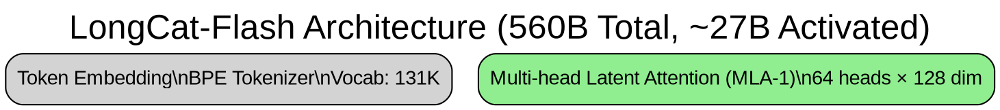

# LongCat-Flash 可视化故障排查案例

## 案例背景
用户请求分析并绘制 LongCat-Flash 模型架构图。

## 遇到的问题

### 第一次失败：中文乱码
**现象：** 生成的 PNG 图片在飞书中显示为乱码

**根本原因：**
1. 使用了中文字符在 Graphviz 标签中
2. Graphviz 的默认字体可能不支持中文字符集
3. 即使系统有中文字体，Graphviz 可能无法正确调用

**解决方案：**
- 改用纯英文标签
- 在必要时指定支持中文的字体（如 `fontname="SimHei"`）

### 第二次失败：DOT 语法错误

**错误信息：**
```
Error: /path/to/file.dot: syntax error in line 43 near '['
```

**根本原因：**
1. **十六进制颜色代码未加引号**
   ```dot
   # 错误写法
   node [fillcolor=#FFE4B5]
   
   # 正确写法  
   node [fillcolor="#FFE4B5"]
   ```

2. **多行标签中的换行符处理不当**
   ```dot
   # 错误：JSON 中的真实换行符
   label="Line 1
   Line 2"
   
   # 正确：使用 \n 转义
   label="Line 1\nLine 2"
   ```

## 成功的解决方案

### 最终采用的方法：手写 DOT 文件



### 关键改进点

1. **使用纯英文标签** - 避免字符编码问题
2. **使用命名颜色** - `lightblue`, `lightgreen` 等，避免引号问题
3. **换行符用 `\n`** - 确保 DOT 语法正确
4. **简化节点信息** - 把详细信息放到外部文档

## 最佳实践建议

### 对于复杂模型架构

1. **先用简单 DOT 测试**
   ```dot
   digraph Test {
       A -> B -> C;
   }
   ```

2. **逐步添加细节**
   - 先画出主要流程
   - 再添加详细标签
   - 最后调整样式

3. **保持标签简洁**
   - 技术细节放到文档中
   - 图表只展示关键信息
   - 使用层次结构（subgraph）

4. **使用安全的配色方案**
   ```
   lightgreen  → Attention 层
   lightcoral  → MoE 层
   lightyellow → FFN 层
   lightblue   → Normalization
   wheat       → Output 层
   ```

### 检查清单

在生成图表前：
- [ ] 所有标签是否为纯 ASCII/英文？
- [ ] 颜色代码是否用引号包裹（或使用命名颜色）？
- [ ] 多行标签是否用 `\n` 而非真实换行？
- [ ] DOT 文件能否独立用 `dot` 命令渲染？

在生成图表后：
- [ ] PNG 文件是否正常生成？
- [ ] 文件大小是否合理（>10KB）？
- [ ] 用图片查看器能否正常打开？

## 工具命令

```bash
# 验证 DOT 语法
dot -Tpng input.dot -o output.png

# 查看生成的图片信息
file output.png
ls -lh output.png

# 如果需要调试，生成 SVG 格式（文本可读）
dot -Tsvg input.dot -o output.svg
```

## 经验总结

1. **自动生成工具不可靠时，手写 DOT 更快**
2. **英文标签 > 中文标签**（即使系统支持中文）
3. **命名颜色 > 十六进制颜色**（更安全，更易读）
4. **简洁图表 > 复杂图表**（配合详细文档）
5. **测试先行**（先用简单例子验证工具链）

## 参考资源

- Graphviz 官方文档：https://graphviz.org/documentation/
- DOT 语言参考：https://graphviz.org/doc/info/lang.html
- 颜色名称列表：https://graphviz.org/doc/info/colors.html
